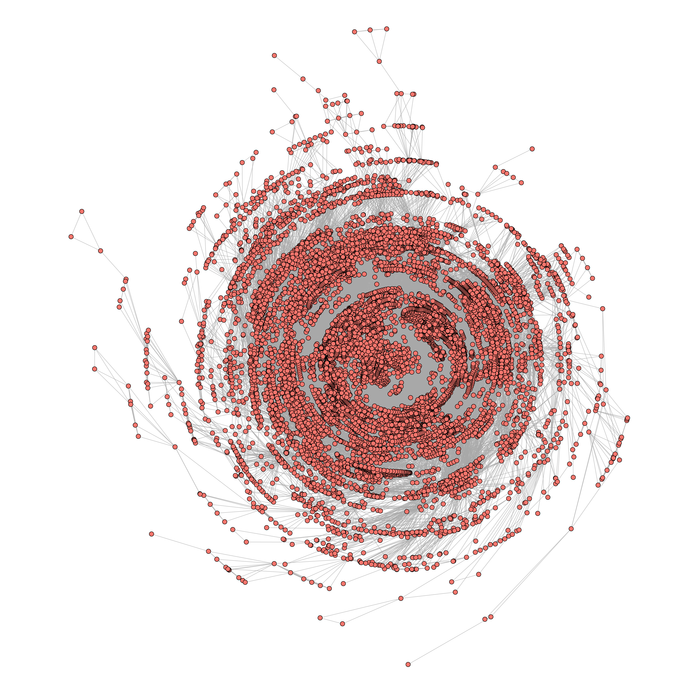

```{r setup, include=FALSE}
knitr::opts_chunk$set(
    echo = FALSE,
    fig.path = "figures/README-"
)
library(ggplot2)
g <- readRDS("processed_data/coauthor-biggest_comp.RDS")
```

## CRAN collaboration graph

The CRAN collaboration graph consists of R package developers who are connected if they
appear together as authors of an R package in the DESCRIPTION file.



The graph consists of `r igraph::vcount(g)` R developers and `r format(igraph::ecount(g),big.mark=",")` collaborative ties.

## Six Degrees of Hadley Wickham

If you are familiar with the [Erdős number](https://en.wikipedia.org/wiki/Erd%C5%91s_number) number and/or the [Bacon number](https://en.wikipedia.org/wiki/Six_Degrees_of_Kevin_Bacon#Bacon_numbers) then you know where this is going. 
The "Hadley number" is defined as the distance of R developers to Hadley Wickham in the collaboration graph.
Someone ("A") who contributed to a package that Hadley has contributed to has a Hadley number of 1. Someone who contributed to a package that A has contributed to but not Hadley has Hadley number 2, and so on. Hadley himself is the only person with Hadley number 0

The distribution of Hadley numbres is shown below.
```{r hadley_distribution}
ggplot(data.frame(dist = igraph::V(g)$dist2HW)) +
    geom_histogram(aes(x = dist), binwidth = 1) +
    theme_minimal() +
    theme(
        panel.grid.major.x = element_blank(),
        panel.grid.minor.x = element_blank()
    ) +
    scale_x_continuous(breaks = 0:10, name = "Hadley Number") +
    scale_y_continuous(seq(0, 6000, 1000), name = "count")
```

The average Hadley number is `r format(mean(igraph::V(g)$dist2HW),digits=4)`.
There is no easy way of checking your own Hadley number yet. For now, you can
download `processed_data/coauthor-biggest_comp.RDS` and do
```r
library(igraph)
g <- readRDS("coauthor-biggest_comp.RDS")
me <- "David Schoch"
idx <- which(V(g)$name==me)
V(g)$dist2HW[idx]
```

## The center of the collaboration network

The center of the collaboration network is defined as the developer who's average distance to all
other developers is the lowest. The top ten developers in that regard are shown below.

```{r center_table}
df <- data.frame(name = igraph::V(g)$name, central = igraph::V(g)$cc / igraph::vcount(g))
knitr::kable(df[order(df$central)[1:10], ], row.names = FALSE)
```

## Disclaimer

The repository only includes the "largest connected component" of the collaboration graph. Developers who have 
single authored one package do not appear in the graph.  

The author field in the DESCRIPTION file can be very messy. I have a very lengthy 
cleaning script (see `Rscripts/helpers.R` and `data/delete_authors.txt`) but the final data is for sure not yet free of errors.